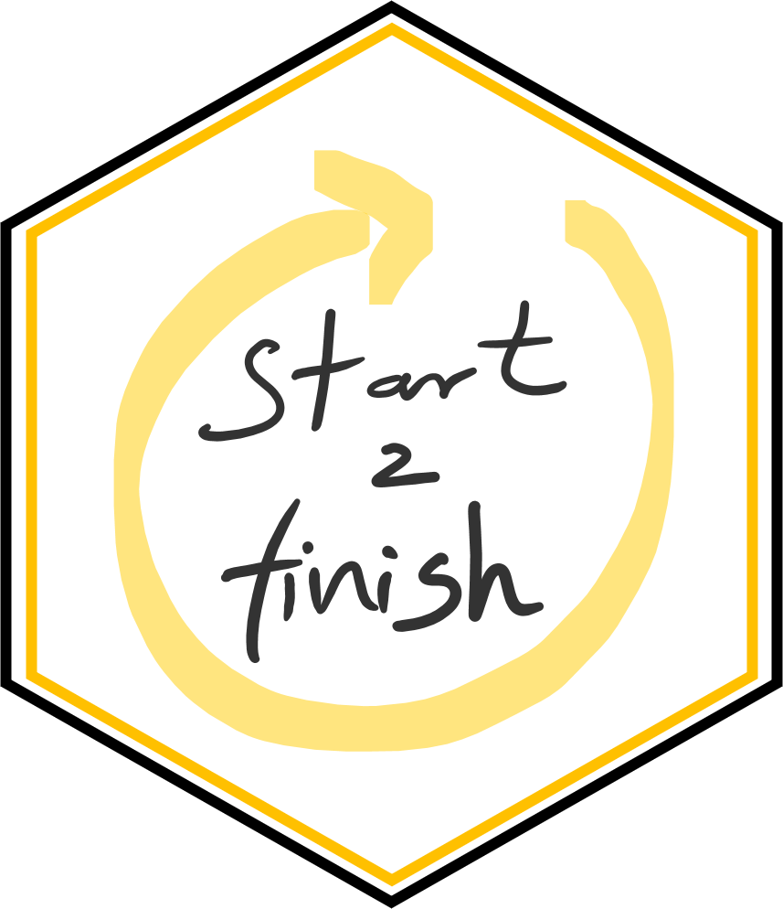

# start2finish 

start2finish is a project I created to share resources and provide a simple starting place for building a reproducible project.
When I created this, I had my mentors and peers in mind, hoping that this guide would take away the fear from creating an R package for their own projects.  

## R from start to finish: Organizing your dissertation work with a reproducibility mindset using R and RStudio
#### I presented this poster at the Ecological Society of America's Annual meeting: [ESA 2020 abstract](https://eco.confex.com/eco/2020/meetingapp.cgi/Paper/86703) and [ESA poster](https://javirudolph.github.io/start2finish/images/rudolph_repro_poster_esa2020.pdf)

---
## A quick introduction  
Have you ever experienced running old code and having it break? Or found the code associated to a scientific article, and when trying to understand it or run it, realize it is almost impossible to figure out? 
As an ecologist, and as many of us, I started my journey with R and data analysis as a self-directed adventure, first learning to code, and later realizing about the importance of reproducibility. Particularly associated with R programming, there is an overwhelming number of resources for reproducible research. This poster is meant to be a resource, a short guide and starting point for setting up a reproducible workflow in R.  
Most of the workflow relies on the [`usethis`](https://usethis.r-lib.org/) package and you can find a short tutorial on building packages [here](https://javirudolph.github.io/RLadies-Gainesville-FL/20190429-Rudolph-packages/apr29presentation.html#1).

### Why packages and not just projects?  
Perhaps this depends on the type of work you do, I'm not an expert and don't have particularly strong opinions. However, a package makes you follow certain conventions to keep things organized. I am a fan of writing functions in an R package and writing detailed documentation using the ['roxygen2'](https://roxygen2.r-lib.org/) package. Building a package is a nice way to keep things together, organized, and clear. Although I am sure that you can also create a chaotic package as well. 

### Git and GitHub
Although you don’t need these two for setting up a project in R but maintaining version control is highly recommended and fundamental for reproducibility. This means that there is a history for your code and analysis. Connecting Git and GitHub to RStudio is system dependent, a good resource for this process can be found in happygitwithr.com 


---
## The setup  
Before you run these steps, make sure you have installed the following packages: `usethis`, `roxygen2`, `renv`, `here`. 
1. Create the package, add a license if you want to, and if feeling adventurous you can create a GitHub repo for it. The reference functions for the `usethis` package can be found [here](https://usethis.r-lib.org/reference/index.html). Running this function will open a new R session with your package! 
```r
usethis::create_package("your package path")
```
2. Keep track of the packages that you use with the [`renv`](https://rstudio.github.io/renv/articles/renv.html) package. 
```r
renv::init()
renv::snapshot()
```
3. Use the [`here`](https://here.r-lib.org/) package and avoid starting scripts with `setwd("your/specific/path/that/does/not/work/on/another/computer)`. I will be honest, I had a hard time understanding this package, until I ran across Jenny Richmond's post on [how to use the `here` package](http://jenrichmond.rbind.io/post/how-to-use-the-here-package/). It comes down to the difference in file paths between .R and .Rmd files.
```r
here::here()
```
4. Use `dplyr` or base R, to clean your data using R scripts. Any changes or deletions that happen in the spreadsheet are lost and forgotten in the realm of non-reproducible clicks. Clean your data with scripts so that you can always go back to the original and be certain of what changes have been made during the cleanup. [Broman & Wu, 2018](https://www.tandfonline.com/doi/full/10.1080/00031305.2017.1375989) has great advice on working with spreadsheets.  
5. Write your analysis and even your manuscript in `rmarkdown`. There are several packages out there that use `rmarkdown` and will help set up different types of articles. You can even create presentations with `rmarkdown`. For simplicity, if using `rmarkdown` and version control (Git and GitHub), you can avoid having several final.docx versions of your work.  


---
## The workflow  
When I am starting a new project, I follow these steps:
```r
usethis::create_package("projects/mypackage")
usethis::use_mit_license(name = "Your Name")
usethis::use_git()
usethis::use_github()
usethis::use_readme_rmd()
```  
These steps will create my package, my GitHub repo and a README with `rmarkdown` so that I can include chunks of code and figures with it. After that setup I will start tracking my packages:
```r
renv::init()
renv::snapshot()
```  
I will load some of the packages I know I will use in my work:
```r
usethis::use_package("dplyr", "ggplot", "fitdistrplus")
```  
And then save the changes with
```r
renv::snapshot()
```  
After the snapshot, you can commit your changes, and push them to your repo so that your lockfile (`revn.lock`) is updated. Any time that new packages are loaded, you repeat these steps.  
You can create your first script, add a function with descriptions, and use `roxygen2` for that. You can find a short tutorial [here](https://javirudolph.github.io/RLadies-Gainesville-FL/20190429-Rudolph-packages/apr29presentation.html#1)
```r
usethis::use_r("name of your script")
```  
This setup is intended for you to take the leap, and get started. There are a number of resources out there, perhaps too many sometimes. If you'd like to jump over to "how do I write my manuscript in rmarkdown" you should definitely check out Anna Krystalli's [Reproduce a paper in Rmd](https://annakrystalli.me/rrtools-repro-research/paper.html) and follow some of the resources bellow.

---
## Some really good resources
* Anna Krystalli ([@annakrystalli](https://twitter.com/annakrystalli)) and her talk [“Putting the R into Reproducible Research”](https://annakrystalli.me/talks/r-in-repro-research.html#1)
* Sharla Gelfand ([@sharlagelfand](https://twitter.com/sharlagelfand)) and her [talk](https://sharla.party/talk/2020-01-01-rstudio-conf/) at rstudio::conf(2020)
* Karthik Ram ([@_inundata](https://twitter.com/_inundata)), his [GitHub repo](https://github.com/karthik/rstudio2019) and [talk](https://rstudio.com/resources/rstudioconf-2019/a-guide-to-modern-reproducible-data-science-with-r-karthik-ram/) at rstudio::conf(2019)
* [‘thesisdown’ repo](https://github.com/ismayc/thesisdown) from Chester Ismay ([@old_man_chester](https://twitter.com/old_man_chester)) – this one is specific for dissertation writing
* [‘rrtools’](https://github.com/benmarwick/rrtools) project and Ben Marwick ([@benmarwick](https://twitter.com/benmarwick)), who also has several publications on this topic.
* Reproducibility in science – [guide](https://ropensci.github.io/reproducibility-guide/), from [rOpenSci](https://ropensci.org/)
* Open Science Framework ([@OSFramework](https://twitter.com/OSFramework))
* [Broman, K. W., & Woo, K. H. (2018). Data organization in spreadsheets. The American Statistician, 72(1), 2-10.](https://www.tandfonline.com/doi/full/10.1080/00031305.2017.1375989)
* Don’t forget your research services or reproducibility librarian!

